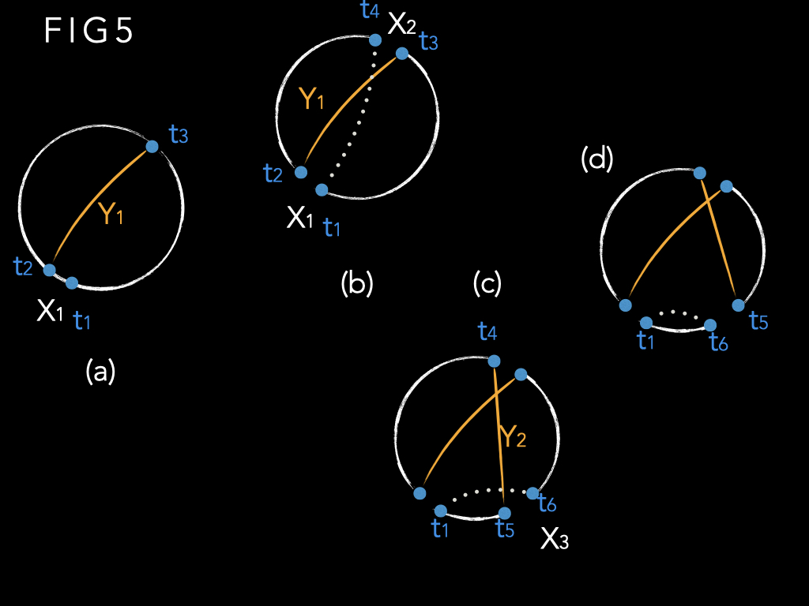

### 一个高效的旅行商(TSP)问题的启发式解法

> S.lin and B.W.Kernighan
> 贝尔实验室, 新泽西州毛利山
> 1975.10.15
>
> 翻译过程中, 译者对原文的订正都会加入标注: ~~~mck

本文讨论了一种高效的启发式程序，用于生成对称旅行商问题的最优和接近最优解。 该过程基于启发式的一般方法，该方法被认为在组合优化问题中具有广泛的适用性。 该程序为所有测试问题提供最佳解决方案、包括: 文献中出现的“经典”问题以及随机生成的测试问题（最多 110 个城市）。 运行时间大约随着 $n^2$ 增长； 对于100 个城市问题来说, 中最好的情况下需要不到 25 秒（GE635）， 正常情况, 95% 置信解需要3分钟

==对称旅行商问题==：给定 n 个城市之间的 n × n 对称距离矩阵，找到一个最短长度的路径，可以恰好访问每个城市一次(回路)。 当然，除了距离之外，还可以考虑其他概念，例如时间、成本等； 我们将使用“距离”来表示任何此类度量。 这个问题已经研究了很多年，精确的算法需要较长的运行时间； 启发式方法可以在合理的时间内为较大的问题提供良好的答案，但不能保证会出现最佳答案。 已有的启发式方法，随着 n 的增加，运行时间会迅速增加，因此几乎没有超过 60 个城市的实用解。
	例如，HELD AND KARP 最近的工作给出了一种解决问题的方法(最小生成树mst), 正是在合理的时间内解决某一类旅行商问题。 然而，如果特定问题不属于此类，则必须通过添加机制（在本例中为分支定界branch and bound）来补充该过程，并且运行时间通常会令人望而却步。 他们报告的最大问题是 64 个城市。

​	KROLAK 等人采取了一种完全不同的方法。他们使用几种快速、简单且效率较低的启发式方法来获得良好的解决方案，然后将人类判断应用于游览图片（“人机交互”）以尝试最佳解决方案。 虽然这种方法已应用于大型问题（200 个城市），但机器时间（尤其是人工时间）成本高昂，而且结果通常不是最优的。 （我们已经改进了五个 100 城市问题中的三个。）此外，无法用于非二维欧式空间.

​	本文讨论了一种新的启发式方法，可以快速生成解决方案, 时间开销大约为 n^2。 程序基于通用启发法, 此法拥有广泛的适用性。 它已经在图划分方面取得了相当大的成功。

==图划分问题==:  给定点集S上的图, 找到与 S-T 最小连接的节点 T 的子集，并且满足 T 和 S-T 具有相同节点数的约束。 图划分问题包含最大割/最小割问题

​	在这篇论文中，我们集中讨论它在旅行商问题上的应用。 我们将讨论启发式过程中涉及的基本原理，并通过对多个案例来说明其有效性

​	许多组合优化问题（例如图划分和旅行商问题）可以抽象地表述为“从集合S中查找子集T, T 是满足约束C 并最优化目标函数 f " 例如，在旅行商问题中，我们必须从所有边的集合中找到形成回路且具有最小长度的子集。
​	对于大多数此类问题，所有已知算法都需要随 n 呈指数增长的计算时间。 （复杂性理论 的最新研究表明，像旅行商问题这样的问题很可能本质上是指数型的。）启发式方法似乎是唯一可行的攻击路线。 从理论角度来看，虽然我们不能普遍证明解的最优性，但我们可以获得统计置信度； 对于实际应用，通常最重要的是在可行的运行时间内获得良好的答案。

组合优化问题启发式的一个基本方法是迭代改进一组随机选择的可行解决方案：

1. 生成伪随机可行解，即满足C的集合T。
2. 尝试通过对 T 进行某种变换来找到改进的可行解 T'。
3. 如果找到改进的解，即 f(T') <f(T)，则将 T 替换为 T'，并从步骤 2 开始重复。
4. 如果找不到改进的解，则T 是局部最优解。 从步骤 1 开始重复，直到计算时间用完，或者答案令人满意。

​	实际的启发式过程（步骤2的转换）将步骤1的随机起始解map到局部最优解，由此全局最优解有望出现。 启发式越好，局部最优解的集合就越小，全局最优值出现的概率越高。 在步骤 1 中选择随机、均匀分布的起始解决方案（而不是好的解决方案），除非我们事先知道某种特定类型的起始解决方案会产生更好的答案。 有两个原因。 首先，一个有价值的启发式方法应该像任何其他启动程序一样快地产生“好的”启动解决方案——这当然是我们的经验。 其次，建设性解决方案通常是确定性的，因此可能无法获得多个初始解决方案。

​	当然，迭代过程的核心是步骤 2，即尝试改进给定解决方案的过程。 一种已应用于各种问题的变换: 将来自T的固定数量的k个元素与来自S-T的k个元素进行交换，使得所得到的解决方案T'是可行且更好的。只要可以找到这样的组，就会重复此过程。 最终这种交换不再进一步提高 T，此时我们就有了局部最优解。 显然, 这里的问题是: 找到正确的组, 通过交换他们即可优化解.

​	这种交换策略被 CROES（2opt, k=2）和 LIN（3opt, k=3）应用于旅行商问题，取得了相当大的成功. 但必须提前指定 k 的值是一个严重的缺点。 计算量随着 k 的增加而迅速增加，并且很难提前知道使用什么 k 作为运行时间和解决方案质量之间的最佳折衷方案。

​	我们的启发式方法是交换变换的变种。 假设 T 是一个非最优但可行的解决方案。 那么我们可以说 T 不是最优的，因为 T 中有 k 个元素$x_1,..., x_k$ 是“错位的”； 为了使 T 最优，它们应该被 S-T 的 k 个元素 $y_1, ..., y_k$代替。 问题只是确定 k 以及 x's 和 y's。 (本问题域, x和y都是边, ~~~mck)

​	由于我们不知道 k 应该是多少，所以很容易想到一个肤浅的方案: 固定 k 然后考虑 T 的所有可能的 k 子集。 反之，我们尝试尽可能逐个元素地找到 k 和$x_1,..., x_k$ 和$y_1, ..., y_k$ 。 因此，我们首先尝试识别“最错位”的对x~i~和y~i~；选择 x~i~y~i~ 并暂时放在一边，然后, 我们继续寻找, 找到 x~2~ 和 Y~2~，即剩余集合中最错位对； 等等。 更正式地说：

1. 生成随机初始解T。
2. (a) 设 i = 1。
    (b) 选择 x~i~ 和 y~i~ 作为第 i 步中最错位的对。 这通常意味着改进会最大化, 发生在交换 T 中$x_1,..., x_k$ 和S-T中的 $y_1, ..., y_k$
    (c) 如果看起来无法再获得更多收益，则根据适当的停止规则，转至步骤 3； 否则，设i=i+1并返回步骤2(b)。
3. 如果找到i=k的最佳改进，则将$x_1,..., x_k$ 和$y_1, ..., y_k$ 交换，得到新的T，并转至步骤2； 如果没有发现改善，请转至步骤 4。
4. 如果需要，请重复步骤 1。

​	为了实现这项工作，显然我们需要做几件事：

1. 我们需要一个选择规则，快速有效地告诉我们哪对当前最错位，因为任何阶段的错误都可能会摧毁后期阶段取得好结果的所有希望。
2. 我们需要一个简单的函数来表示一组交换的总收益。 假设 g~i~是与 x~i~ 和 y~i~ 交换相关的收益，此时 x~1~, y~1~, ..., x~i-1~, y~i-1~ 已被选择。则 $x_1,..., x_k$ 和$y_1, ..., y_k$ 交换的增益为$g_1+ ... +g_k$，此处有意义的性质是: 增益是相加的。
    考虑到这种可加性，当某些 g~i~ 为负时，选择过程不需要立即停止； 事实上，对于所有的k而言, 只有当 $\sum_{i=1}^{i=k}{g_i} \leq 0 $ 时我们才需要停止。 这有助于跳出局部最优解
3. 如果我们要能够对任意k停止选择过程, 开始交换 $x_1,..., x_k$ 和$y_1, ..., y_k$ . 我们必须知道交换是可行的，即得到的解决方案 满足约束 C。因此，我们要求（对于大多数 k）每个需计算的交换都使我们处于可行状态。 首先，这使我们免于数据记录问题，其次，我们不必费尽心思交换集合，却得到无效解。
4. 需要一个停止规则来告诉我们，寻找元素进行交换不可能再有收益，或者至少已经达到了收益递减的地步。 此处需要平衡, 可能花了大量的时间却没有收益(乐观贪婪), 也可能早早放弃导致结果不够好(悲观懒惰)
5. 最后, 我们需要 $x_1,..., x_k$ 和$y_1, ..., y_k$ 不相交, 一旦元素以一种方式移动，则在本次迭代期间不会再次移动回来。 （下一轮交换, 它很可能会回来）这在很大程度上是实用的 -- 它避免了各种微妙的实现错误，减少了运行时间，简化了增益函数，并提供了有效的停止规则。

在我们测算待交换序列 $x_1,..., x_m$ 和$y_1, ..., y_m$ 的增益为$g_1, ..., g_m$时，此时真正要交换的集合(k)的收益($g_1+ ... +g_k$ )是最大值（并且可行）。 如果这是一个改进，则交换此集合形成解决方案T，并且从这个新的起点迭代该过程。 

最终我们到达($g_1+ ... +g_k$ ) 始终为零或负值的点。 这表明该过程无法进行进一步的改进，因此此时的解决方案是我们的局部最优解。 

尽管在上面的讨论中我们假设每个可行集都具有相同的基数，但基本思想可以很容易地适应不定尺度的T 和 S-T 。

### 1. 基本TSP算法

为了将此方法应用于旅行推销员问题，令 S 为所有边的集合 [即 n 个城市之间的 n(n-l)/2 条边]，并令 T 为通路, 他是的 S 的子集, 有n个条边, 且满足约束C. 我们想要找到一个长度最小的通路（目标函数 f）。
考虑长度为 f(T) 的任意游览 T 和长度为 f(T') <f(T) 的任意游览 T'。 假设 T 和 T' 相差 k 个链接（作为 n 个链接的集合）。 我们的基本算法尝试通过顺序识别 T 和 S-T 之间要交换的 k 对链接来将 T 转换为 T'。 也就是说，我们尝试找到两组链接(边) X= I x1, * * *, xk} 和 Y= { yl, 。 , yA} 这样，如果 X 中的链接被删除或“破坏”并被 Y 中的链接替换，则结果是成本更低的旅行。

###### 图1说明了k=3的情况。

图1(a)是行程T，表示X和Y； 图 1 (b) 显示了所得的 T'。 请注意，我们以自然的方式对受影响的链接进行了编号：x~i~ 和 y~i~ 共享一个端点，y~i~ 和 x~i+1~共享另一个端点。 通常可以执行此编号，从而将 T 顺序转换为 T'。 

###### 图 2

显示了一个不可能进行这种编号的示例。这种情况在我们研究的问题中很少出现。

假设可以进行这种编号(只是为了描述方便, 并非必要条件)，我们希望可以找到这些待交换的边x~1~,y~1~;  x~2~, Y~2~; ... 等。由于我们不知道 T' 可能是什么，因此当然要尝试找到任何将 T 化为 T' 且 f(T') <f (T) 的序列，并在 T' 上迭代该过程 直到无法进一步减少为止。
设 x~i~ 和 y~i~ 的长度分别为 |x~i~| 和 |y~i~|，并定义 g~i~= |x~i~| - |y~i~| 这就是x~i~与y~i~交换的收益。 虽然有些 g~i~ 可能是负的，但如果 f(T') <f (T)，显然 $\sum_1^k{g_i} = f(T) -f(T') >0 $   , 我们的过程的一部分基于以下简单的事实：如果一个数字序列具有正和，则此序列(循环)至少存在一个子序列(循环)，他的每个组成部分和都是正的.

证明: 

1. 假设k是最大的集合的索引(循环数列的元素数量), 保证g~1~+...+g~k-1~是最小值(注意, 此处是==循环==序列的最小值)

2. 如果k<=j<=n, 

   g~k~+...+g~j~ =(g~1~+...+g~j~)-(g~1~+...+g~k-1~)>0

3. 如果1<=j<k,

   (g~k~+...+g~n~)+(g~1~+...+g~j~)>=(g~k~+...+g~n~)+(g~1~+...+g~k-1~)>0

特别是，由于我们正在寻找具有正和的 g~i~ 序列，==因此我们只需要考虑其部分和始终为正的增益序列==。 这个增益标准使我们能够极大地减少需要检查的序列数量； 这是我们停止规则的核心。
我们现在概述基本启发式算法。 

> 图 3 说明了该算法。

图例~~~mck:

1. x初始的边
2. y替换x的, 形成改进的边
3. t, x的点, 同时也是y的点

1. 生成一个随机的通路T

2. 设G*=0, G是目前为止最好的改进, 选择任意节点t~1~,  设x~1~为联通t~1~的边(属于通路T), 此时i=1

3. 从x~1~的另一个定点t~2~ 链接一条边y~1~ 到t~3~, 让g~1~>0.  如果没有这样的y~1~, 那么就是到步骤6D(这是增益原则的一次应用)

###### 图三, 描述了步骤4,  其中

* a: i=2, 
* b: i=4, 注意此时t~8~是唯一的, 
* c: i=5, 注意t~2~(原文t~5~应是笔误~~~mck)的两个边都被打破了, 
* d: 步骤6c描述了的, 关于y~1~的选择

4. 此时i=i+1,  选择x~i~(他的两个端点t~2i-1~和t~2i~), 和y~i~, 选择x~i~的方式如下: 

   a. 当我们选择了边x~i~时, 如果t~2i~连接到t~1~, 那么这里形成了通路(理由是: 任何的新边y~i-1~都必然联系唯一且不重复的x~i~, 这保证了我们一定可以闭环: 通过联通t~2i~到t1, 4e步骤选择了y~i-1~,这个步骤保证了我们一定有x~i~)

   b. y~i~和x~i~公用终点t~2i~, 参考后面cbd三个条, 如果y~i~不存在, 参考条5. (因为要节约第i个步骤, 所以y~i~要比较小才行, 因此, 此时可以用邻域的概念, 找相邻较近的点连接y~i~)

   c. 为了保证x和y的正确性, x不能是之前的y, y也不能是之前的x

   d. $G_i=\sum_{1}^{i}{g_j} > 0 $ , 标准(初始~~~mck)增益

   e. 为了保证a描述的可行性, y~i~必须联通x~i+1~, (另一端联通x~i~ ~~~mck)

   f. 正式确定y~i~之前, 我们要确认这个改进是目前为止的最佳改进. (我们确认目前是一个通路, 只要$i\geq2$), 此时, 使 y~i~\*作为链接t~2i~和t~1~的边, 并且g~i~\*=|y~i~\*|-|x~i~|. G~i-1~+g~i~\* > G\*, 让 G\*=G~i-1~+g~i~\*,且k=i. (在通路T中, 目前为止G\*是最佳方案)[G\* 始终是迄今为止记录的 T 的最佳改进，因此是我们的比较标准。 G\* >O，并且是单调非减的。 索引 k 定义了要交换以获得 G\* 的集合。] ---此段落并未理解, ~~~mck todo

5. 当没有进一步的链接 xi 和 yi 满足 4(c)-(e) 时，或者当 Gi<G\* 时，终止步骤 2 到 4 中 xi 和 yi 的构造。 [这是我们的停止标准。] 如果 G\*>O，则以 f(T') =f(T) - G\* 形成通路T'，并使用 T' 作为初始通路，重复步骤 2 的整个过程。

6. 如果 G* =0，则调用有限回溯功能，如下所示：

   (a) 重复步骤 4 和 5，按照长度递增的顺序选择 Y~2~，只要它们满足增益准则g~i~ +g~2~ >0。 [如果任何时候发现改进，当然，这会导致返回步骤 2。]
   (b) 如果步骤 4(b) 中 y~2~ 的所有选择都用尽而没有改进，则返回步骤 4(a) 并尝试 x~2~ 的替代选择。 [打破替代x~2~引入临时违规可行性； 我们在算法描述之后详细讨论这一步。]
   (c) 如果这也未能提供改进，则执行步骤 3 的进一步尝试，其中按长度递增的顺序检查 y~i~
   (d) 如果 y~1~ 也耗尽而没有改进，我们在步骤 2 中尝试替代 x~1~

   (e) 如果失败，则选择一个新的 t~1~，然后重复步骤 2。

   [请注意，仅当找不到增益时才执行此回溯，并且仅在级别 1 和 2（i = 1 和 i = 2）处执行。 我们将在下一节中进一步讨论回溯。]

7. 当 t~1~ 的所有的 n个 值都已被检查且没有任何改进时，该过程终止。 这时，我们可以考虑在步骤1中进一步随机游览。

###### 图四展示了x2的后续情况

* (a), x2是不可以直接close的
* (b), x3有两个可能(黄点描述了t6的两个可能 ~~~mck)
* (c), x3只有一个可能(t6只有一个可能, 另一边也是导致了无法闭环~~~mck), y3也受到了限制

除了讨论破坏位于 t3 和 ti 之间的 x2 的影响之外，算法的描述到此结束，如图 4(a) 所示。 我们允许后一种可能性，因为虽然它增加了一些复杂性，但它大大提高了整体效率。 仅当 i=2 时才允许选择不可行的替代方案。
在图 4(a) 中，Y2 不得与 ti 连接，因为这会留下两个不相连的半部。 现在，如果 t5 位于 t2 和 t3 之间，则 t6 可能位于 t5 的任一侧，并且事实上，如果第一种可能性不会导致有利可图的交换，则将研究第二种可能性。 见图4(b)。
如果t5位于t1和t4之间，如图4（c）所示，则t6只有一个选择（它必须位于t5和t4之间，以满足可行性标准）并且t7必须位于t2和t3之间, 但是t8可能在t7的两边, 此时, 我们选择一个使得|x4|最大.

现在我们回过头来再次讨论步骤4

###### 图五, 一个示例

- (a), 步骤3
- (b), 步骤4 i=2的时候是可以闭环的
- (c), 唯一的x3的选择, i=3有闭环潜力
- (d), 禁手x3和t6

##### 一个例子

从图 5(a) 显示的通路 T 和两个相邻节点t1 和 t2开始； x1是连接它们的边。 令 t3 为距离 t2 最近的节点； Y1 是边（t2，t3）。由于 x 和 y 不相交，因此 y1 不允许是已连接到 t2 的任何一条边(邻居~~~mck)。 设 g1 = |x1| - |y1|; 如果这不是正数，我们返回[步骤 6(d)] 并选t1 的另一边的邻居作为t2。 设i=2，t4为t3的邻居，如图5(b)所示。 x2 是边 (t3, t4)。

现在，如果选择 Y2 将 14 连接到 ti，结果将是一条通路，如果 g1+g2>0，我们可以通过用 Y1 和 Y2 交换 x1 和 x2 来改进 T。 记住这个潜在的改进——这是G\*； 步骤4(f), k=2时。 选择 距离t4最近的t5 作为边y2 (t4, t5)。 同样，t5 不能是任何一个已经和t4联通的节点(邻居~~~mck)

如图 5(c) 所示，t6 和x3只有一种选择 - 如果我们让 X3 为t5的另外一个邻居, 那么通路会成为两个分离的部分(两截断头路~~~mck)，如图5（d）所示。

再次，我们检查闭环（将 t6 连接到 t1）是否比通过将 t4 连接到 t1更优, 从而更新 G\* 并设置 k =3。 如果 $g1 +g2+g3 \leq G*$，则触发停止规则: k = 2 。如果 Y3 是最佳选择，我们同样停止与(t6, t1)。 否则，我们继续选择 t7，依此类推。

实际测试表明，此算法的计算量远远小于浅遍历，很大程度上是因为增益标准非常强。 每个局部最优值的计算时间取决于回溯量，但正如我们所描述的，计算量约为 n^2.2^(可能是n^2^~log~n)。 我们将在第 3 节末尾进一步讨论这一点。

通路可行性的判断标准对于$i \geq 2或3$(取决于x2的选择)是安全的。 因为在每个阶段我们都尝试通过选择较小的 Yk 来最大化 Gk，实际上是寻找不合适的边. 在 $G_k \leq G^*$ 时立即终止，由此我们剪枝了无结果的深度探索。 平均超调量（即搜索深度减去k)的值并不大。 通常情况下，最初发现的几项改进过程具有较大的 k 值：一般有(3/4)n的局面是无改进的。 逐渐地，改进变得越来越难找到，最终为一系列较小的变化（大约 2-7），有一些超调。 改进的数量通常在n/4和n/3之间。
很容易看出，从该启发式算法获得的局部最优解必然是参考文献11意义上的3-opt，因此保证结果与参考文献11中获得的结果一样好，并且时间要少得多。

##### 回溯

正如基本程序的步骤 6 和 7 中提到的，回溯受到严格限制。 显然，原则上可以通过在所有级别上进行回调来找到最佳方案，但是这样一个过程的运行时间将是巨大的。 我们的回溯平衡了时间和能效。 

测量表明，如果要在某个节点处找到增益，通常是第一个选择（第一级的平均选择数为 1.2，第二级为 1.8）。 因此，我们实际上只考虑y1和y2的几个选项（目前各最多五个）。 实验表明，这对最优值的频率没有显着影响，相对于在考虑所有 yi 和 Y2 的情况下，运行时间减少了近两倍。 如果 Y1 和 Y2 各只有两个选项，确实会降低质量，尽管运行时间也会进一步减少。
第三层回溯会极大的增加时间开销。 仅在第一级回溯会削弱效果：尽管与具有更多回溯的解决方案相比，解决方案具有相当好的成本，但最优方案的出现频率较低。 （对于大问题或全局最优值不重要的问题，这可能是值得节省的）

### 2. 改进

之前描述的算法非常有效，但我们还是添加了一些改进，可以大大提高效果，而无需显着的额外成本。

##### A. 避免核验时间(禁忌所搜~~~mck)

当通路T的值为f时, 在某个节点t，然后无法取得进步，我们说 T 是局部最优的，由此定义核验时间为: 发现T之后, 继续检查所有可能性直到确认T是局部最优解, 所花费的时间, 如果在稍后的情况下，我们到达同一个旅行 T，则尝试找到进一步的减少是没有意义的——这种情况之前已被“核验过过”。' 因此，在无法进行改进的情况下，为了节省运行时间
节点，测试得到的解是否与之前的解相同； 如果是这样，可以避免核验时间。 这通常占时 30% 到 50%的运行时间。

##### B. 前瞻
所描述的过程选择链接yi，而不考虑x~i+1~(必须在下一阶段将其破坏)大小。 如果这个 x~i+1~ 实际上是一个“好的”链接，即成本低的链接，其结果往往经过漫长而徒劳的追逐, 从而发现真相：打破 x~i+1~是错误的，因此 yi 是一个糟糕的选择。

为了克服这个弱点，在过程中添加了受限的前瞻：在选择 yi 的所有步骤中，选择不是基于 |yi| 而是通过尝试最大化|x~i+1~|-|yi| 来做出的。 当 i 为 1 或 2 时，这会改变链接的顺序考虑，这可能会对解决方案产生影响。 （参见下一段落）在后续阶段（$i\geq3$）中，意味着选择对应|x~i+1~|-|yi| 最大值的对应的yi。 人们可能会认为我们应该最大化|x~i+1~|-|yi| 在所有的处理 yi的时候，但经过实验，我们拒绝了这个，因为太耗时。 目前，我们使用五个最小（可用）yi 中发现的最大的|x~i+1~|-|yi|，它似乎同样有效且速度更快。

使用前瞻, 还有另一个更微妙的理由。如果我们决定仅在最近邻居优先的基础上加入链接，我们就陷入了局部最优。 这意味着每当可以选择加入此链接而不是其他链接, 最近邻居链接总是被选择，如果这是错误的，就没有办法避免它。 但如果我们使用|x~i+1~|-|yi|作为标准，可以选择也可以不选择 yi，具体取决于 x~i+1~，它是当前游览状态的函数，因此本质上更具全局性。这为程序提供了更大弹性，并提高了正解的机会。

##### C. 归约(剪枝:归并缩减)
一旦通过迄今为止所描述的过程找到了一些局部最优的通路，我们就会观察到某些链接出现在所有这些旅行中。 由于此后的过程所花费的大部分时间本质上是通过反复破坏这些良好链接来重复先前的工作，因此我们设计了一种缩减功能，尝试使用此信息来指导进一步的搜索（并顺便节省运行时间）。

发现了少量（当前在两个到五个之间）不同的局部最优值。 （如果我们无法在合理的尝试次数中找到两个不同的旅行，我们以此作为单一解决方案不会得到改进的初步证据。）记录所有这些解决方案共有的所有链接。 现在（“缩减后”）继续寻找局部最优解决方案，并附加限制，即如果链接 xi 出现在这组好链接中，则链接 xi 不会被破坏。 随着新的局部最优解的获得，继续记录分叉路口。

减少的影响可以通过多种方式感受到。 最明显的是戏剧性的运行时间减少（通常为五倍），因为剩下的可供评估的情况太少了。 减少程序已经“修剪了树”的可能情况。 如果局部最优游览有许多共同点（两个不同的局部最佳游览通常有 85% 的共同点，甚至 7 或 8 个也将有 60-80%），那么算法需要评估的可能性就会减少。 （请记住，良好的链接对应于 yi 的最小值，因此，当通过归约消除这些值时，增益标准将成为更强大的消除器。）

然而，节省时间并不是我们引入归约的唯一目的。 相反，归约是在一组原本无法区分的情况下进行搜索的一种方法。 实际上，我们的意思是，某些情况可能会立即被拒绝，因为它们涉及破坏链接，这些链接出现在太多优秀的旅游中，不可能是偶然的； 破坏这样的链接很可能是错误的，我们应该尝试其他方法。

但归约显然会使我们得到的解决方案产生偏差。 假设当我们寻找预还原旅行时，最优值没有出现。 那么归约的基础只包含次优解，而归约后的过程可能无法突破这一点而真正获得最优解。 因此，我们稍微修改了约简——在归约通路的岔路口, 没有 xi 可能会在 4 级或更深级别被破坏, 我们仍然可以在级别 1、2 和 3 处根据需要断开链接。这种“部分减少”为我们提供了一些灵活性，可以从错误的减少选择中恢复，但保留了完全减少的大部分路径引导和节省时间的特性 。

由于该过程以遍历过得所有通路的岔路口的归约的基础，因此具有一定的收敛效果。 如果我们一开始的旅行很糟糕，但后来得到了正解，那么从那时起，最佳路线应该会更频繁地出现（尽管随着交叉路口变小, 耗时也减小了）。

##### D. 非顺序交换

正如我们之前观察到的（见图 2），某些配置无法通过更改链接的连接序列来改进。对此, 运算过程增加了有限的针对性改进。 找到局部最优的旅行后，我们测试在旅行中可能被破坏的链接中（由归约程序确定）是否可以通过交换(如图2所示)进行进一步的改进. 由于此归约和原始通路之间不同的链接数量很少(y1, y2, y3, y4, 就8个点~~~mck)，因此此测试很快。 该过程是否产生所需的改进因问题而异：在某些情况下，它将大多数非最佳解决方案转换为最佳解决方案，而在其他情况下，它没有任何效果。 在我们的实施中，每个独特游览的运行时间低于 50 毫秒，因此这并不是非常昂贵的保险。

### 3. 测试结果

- 作为论文, 这是占据1/3篇幅的重要内容, 但是, 对我而言, 不太重要....
