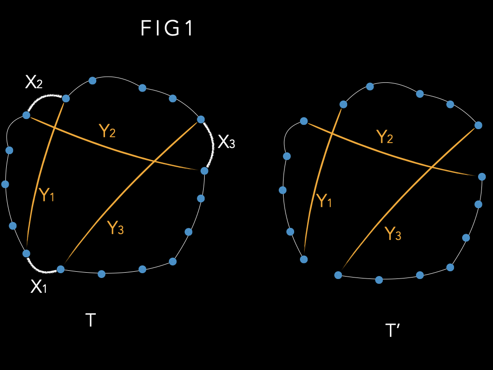
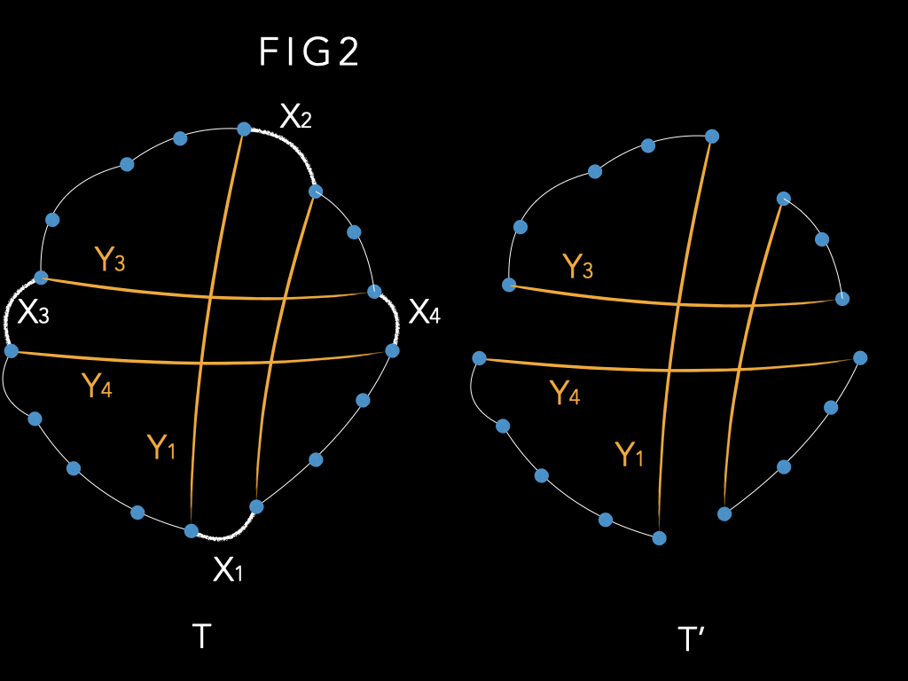
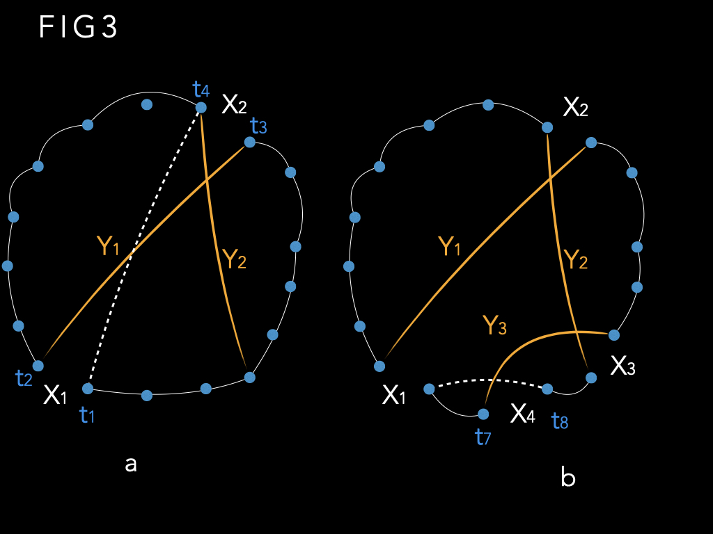
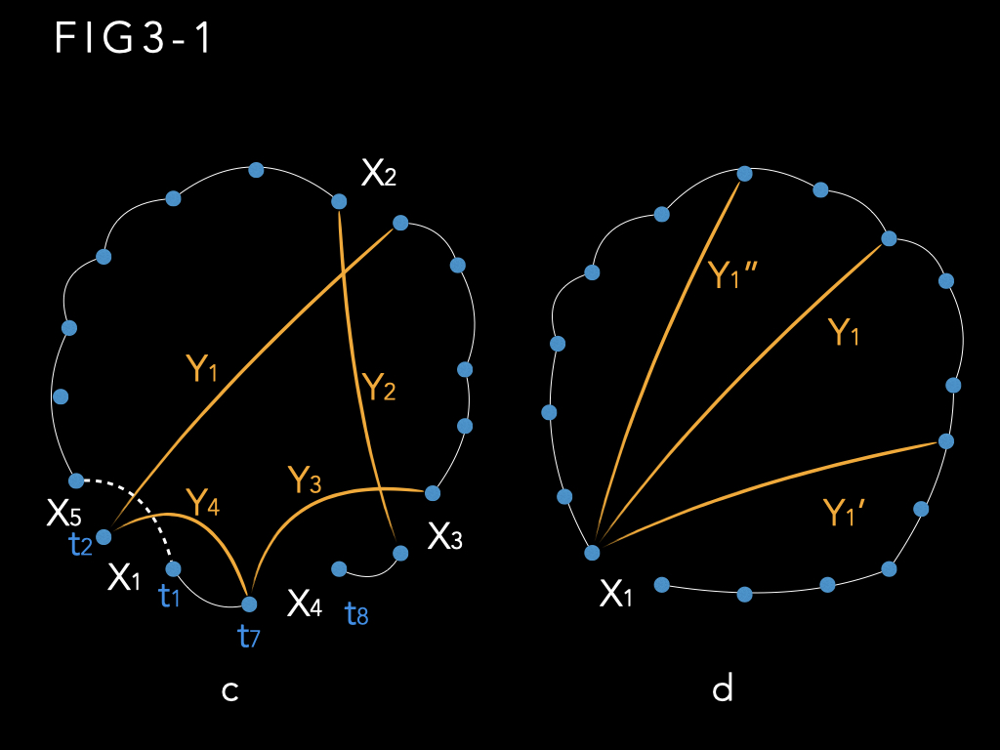

### 一个高效的旅行商(TSP)问题的启发式解法

> S.lin and B.W.Kernighan
> 贝尔实验室, 新泽西州毛利山
> 1975.10.15

本文讨论了一种高效的启发式程序，用于生成对称旅行商问题的最优和接近最优解。 该过程基于启发式的一般方法，该方法被认为在组合优化问题中具有广泛的适用性。 该程序为所有测试问题提供最佳解决方案、包括: 文献中出现的“经典”问题以及随机生成的测试问题（最多 110 个城市）。 运行时间大约随着 $n^2$ 增长； 对于100 个城市问题来说, 中最好的情况下需要不到 25 秒（GE635）， 正常情况, 95% 置信解需要3分钟

==对称旅行商问题==：给定 n 个城市之间的 n × n 对称距离矩阵，找到一个最短长度的路径，可以恰好访问每个城市一次(回路)。 当然，除了距离之外，还可以考虑其他概念，例如时间、成本等； 我们将使用“距离”来表示任何此类度量。 这个问题已经研究了很多年，精确的算法需要较长的运行时间； 启发式方法可以在合理的时间内为较大的问题提供良好的答案，但不能保证会出现最佳答案。 已有的启发式方法，随着 n 的增加，运行时间会迅速增加，因此几乎没有超过 60 个城市的实用解。
	例如，HELD AND KARP 最近的工作给出了一种解决问题的方法(最小生成树mst), 正是在合理的时间内解决某一类旅行商问题。 然而，如果特定问题不属于此类，则必须通过添加机制（在本例中为分支定界branch and bound）来补充该过程，并且运行时间通常会令人望而却步。 他们报告的最大问题是 64 个城市。

​	KROLAK 等人采取了一种完全不同的方法。他们使用几种快速、简单且效率较低的启发式方法来获得良好的解决方案，然后将人类判断应用于游览图片（“人机交互”）以尝试最佳解决方案。 虽然这种方法已应用于大型问题（200 个城市），但机器时间（尤其是人工时间）成本高昂，而且结果通常不是最优的。 （我们已经改进了五个 100 城市问题中的三个。）此外，无法用于非二维欧式空间.

​	本文讨论了一种新的启发式方法，可以快速生成解决方案, 时间开销大约为 n^2。 程序基于通用启发法, 此法拥有广泛的适用性。 它已经在图划分方面取得了相当大的成功。

==图划分问题==:  给定点集S上的图, 找到与 S-T 最小连接的节点 T 的子集，并且满足 T 和 S-T 具有相同节点数的约束。 图划分问题包含最大割/最小割问题

​	在这篇论文中，我们集中讨论它在旅行商问题上的应用。 我们将讨论启发式过程中涉及的基本原理，并通过对多个案例来说明其有效性

​	许多组合优化问题（例如图划分和旅行商问题）可以抽象地表述为“从集合S中查找子集T, T 是满足约束C 并最优化目标函数 f " 例如，在旅行商问题中，我们必须从所有边的集合中找到形成回路且具有最小长度的子集。
​	对于大多数此类问题，所有已知算法都需要随 n 呈指数增长的计算时间。 （复杂性理论 的最新研究表明，像旅行商问题这样的问题很可能本质上是指数型的。）启发式方法似乎是唯一可行的攻击路线。 从理论角度来看，虽然我们不能普遍证明解的最优性，但我们可以获得统计置信度； 对于实际应用，通常最重要的是在可行的运行时间内获得良好的答案。

组合优化问题启发式的一个基本方法是迭代改进一组随机选择的可行解决方案：

1. 生成伪随机可行解，即满足C的集合T。
2. 尝试通过对 T 进行某种变换来找到改进的可行解 T'。
3. 如果找到改进的解，即 f(T') <f(T)，则将 T 替换为 T'，并从步骤 2 开始重复。
4. 如果找不到改进的解，则T 是局部最优解。 从步骤 1 开始重复，直到计算时间用完，或者答案令人满意。

​	实际的启发式过程（步骤2的转换）将步骤1的随机起始解map到局部最优解，由此全局最优解有望出现。 启发式越好，局部最优解的集合就越小，全局最优值出现的概率越高。 在步骤 1 中选择随机、均匀分布的起始解决方案（而不是好的解决方案），除非我们事先知道某种特定类型的起始解决方案会产生更好的答案。 有两个原因。 首先，一个有价值的启发式方法应该像任何其他启动程序一样快地产生“好的”启动解决方案——这当然是我们的经验。 其次，建设性解决方案通常是确定性的，因此可能无法获得多个初始解决方案。

​	当然，迭代过程的核心是步骤 2，即尝试改进给定解决方案的过程。 一种已应用于各种问题的变换: 将来自T的固定数量的k个元素与来自S-T的k个元素进行交换，使得所得到的解决方案T'是可行且更好的。只要可以找到这样的组，就会重复此过程。 最终这种交换不再进一步提高 T，此时我们就有了局部最优解。 显然, 这里的问题是: 找到正确的组, 通过交换他们即可优化解.

​	这种交换策略被 CROES（2opt, k=2）和 LIN（3opt, k=3）应用于旅行商问题，取得了相当大的成功. 但必须提前指定 k 的值是一个严重的缺点。 计算量随着 k 的增加而迅速增加，并且很难提前知道使用什么 k 作为运行时间和解决方案质量之间的最佳折衷方案。

​	我们的启发式方法是交换变换的变种。 假设 T 是一个非最优但可行的解决方案。 那么我们可以说 T 不是最优的，因为 T 中有 k 个元素$x_1,..., x_k$ 是“错位的”； 为了使 T 最优，它们应该被 S-T 的 k 个元素 $y_1, ..., y_k$代替。 问题只是确定 k 以及 x's 和 y's。

​	由于我们不知道 k 应该是多少，所以很容易想到一个肤浅的方案: 固定 k 然后考虑 T 的所有可能的 k 子集。 反之，我们尝试尽可能逐个元素地找到 k 和$x_1,..., x_k$ 和$y_1, ..., y_k$ 。 因此，我们首先尝试识别“最错位”的对x~i~和y~i~；选择 x~i~y~i~ 并暂时放在一边，然后, 我们继续寻找, 找到 x~2~ 和 Y~2~，即剩余集合中最错位对； 等等。 更正式地说：

1. 生成随机初始解T。
2. (a) 设 i = 1。
  (b) 选择 x~i~ 和 y~i~ 作为第 i 步中最错位的对。 这通常意味着改进会最大化, 发生在交换 T 中$x_1,..., x_k$ 和S-T中的 $y_1, ..., y_k$
  (c) 如果看起来无法再获得更多收益，则根据适当的停止规则，转至步骤 3； 否则，设i=i+1并返回步骤2(b)。
3. 如果找到i=k的最佳改进，则将$x_1,..., x_k$ 和$y_1, ..., y_k$ 交换，得到新的T，并转至步骤2； 如果没有发现改善，请转至步骤 4。
4. 如果需要，请重复步骤 1。

​	为了实现这项工作，显然我们需要做几件事：

1. 我们需要一个选择规则，快速有效地告诉我们哪对当前最错位，因为任何阶段的错误都可能会摧毁后期阶段取得好结果的所有希望。
2. 我们需要一个简单的函数来表示一组交换的总收益。 假设 g~i~是与 x~i~ 和 y~i~ 交换相关的收益，此时 x~1~, y~1~, ..., x~i-1~, y~i-1~ 已被选择。则 $x_1,..., x_k$ 和$y_1, ..., y_k$ 交换的增益为$g_1+ ... +g_k$，此处有意义的性质是: 增益是相加的。
  考虑到这种可加性，当某些 g~i~ 为负时，选择过程不需要立即停止； 事实上，对于所有的k而言, 只有当 $\sum_{i=1}^{i=k}{g_i} \leq 0 $ 时我们才需要停止。 这有助于跳出局部最优解
3. 如果我们要能够对任意k停止选择过程, 开始交换 $x_1,..., x_k$ 和$y_1, ..., y_k$ . 我们必须知道交换是可行的，即得到的解决方案 满足约束 C。因此，我们要求（对于大多数 k）每个需计算的交换都使我们处于可行状态。 首先，这使我们免于数据记录问题，其次，我们不必费尽心思交换集合，却得到无效解。
4. 需要一个停止规则来告诉我们，寻找元素进行交换不可能再有收益，或者至少已经达到了收益递减的地步。 此处需要平衡, 可能花了大量的时间却没有收益(乐观贪婪), 也可能早早放弃导致结果不够好(悲观懒惰)
5. 最后, 我们需要 $x_1,..., x_k$ 和$y_1, ..., y_k$ 不相交, 一旦元素以一种方式移动，则在本次迭代期间不会再次移动回来。 （下一轮交换, 它很可能会回来）这在很大程度上是实用的 -- 它避免了各种微妙的实现错误，减少了运行时间，简化了增益函数，并提供了有效的停止规则。

在我们测算待交换序列 $x_1,..., x_m$ 和$y_1, ..., y_m$ 的增益为$g_1, ..., g_m$时，此时真正要交换的集合(k)的收益($g_1+ ... +g_k$ )是最大值（并且可行）。 如果这是一个改进，则交换此集合形成解决方案T，并且从这个新的起点迭代该过程。 

最终我们到达($g_1+ ... +g_k$ ) 始终为零或负值的点。 这表明该过程无法进行进一步的改进，因此此时的解决方案是我们的局部最优解。 

尽管在上面的讨论中我们假设每个可行集都具有相同的基数，但基本思想可以很容易地适应不定尺度的T 和 S-T 。

### 1. 基本TSP算法

为了将此方法应用于旅行推销员问题，令 S 为所有边的集合 [即 n 个城市之间的 n(n-l)/2 条边]，并令 T 为通路, 他是的 S 的子集, 有n个条边, 且满足约束C. 我们想要找到一个长度最小的通路（目标函数 f）。
考虑长度为 f(T) 的任意游览 T 和长度为 f(T') <f(T) 的任意游览 T'。 假设 T 和 T' 相差 k 个链接（作为 n 个链接的集合）。 我们的基本算法尝试通过顺序识别 T 和 S-T 之间要交换的 k 对链接来将 T 转换为 T'。 也就是说，我们尝试找到两组链接 X= I x1, * * *, xk} 和 Y= { yl, 。 , yA} 这样，如果 X 中的链接被删除或“破坏”并被 Y 中的链接替换，则结果是成本更低的旅行。

图1说明了k=3的情况。图1(a)是行程T，表示X和Y； 图 1 (b) 显示了所得的 T'。 请注意，我们以自然的方式对受影响的链接进行了编号：x~i~ 和 y~i~ 共享一个端点，y~i~ 和 x~i+1~共享另一个端点。 通常可以执行此编号，从而将 T 顺序转换为 T'。 

图 2 显示了一个不可能进行这种编号的示例。这种情况在我们研究的问题中很少出现。

假设可以进行这种编号(只是为了描述方便, 并非必要条件)，我们希望可以找到这些待交换的边x~1~,y~1~;  x~2~, Y~2~; ... 等。由于我们不知道 T' 可能是什么，因此当然要尝试找到任何将 T 化为 T' 且 f(T') <f (T) 的序列，并在 T' 上迭代该过程 直到无法进一步减少为止。
设 x~i~ 和 y~i~ 的长度分别为 |x~i~| 和 |y~i~|，并定义 g~i~= |x~i~| - |y~i~| 这就是x~i~与y~i~交换的收益。 虽然有些 g~i~ 可能是负的，但如果 f(T') <f (T)，显然我们有 g~i~ =f(T) -f(T') >0。 我们的过程的一部分基于以下简单的事实：如果一个数字序列具有正和，则此序列(循环)至少存在一个子序列(循环)，他的每个组成部分和都是正的.

证明: 

1. 假设k是最大的集合的索引(循环数列的元素数量), 保证g~1~+...+g~k-1~是最小值(注意, 此处是==循环==序列的最小值)

2. 如果k<=j<=n, 

   g~k~+...+g~j~ =(g~1~+...+g~j~)-(g~1~+...+g~k-1~)>0

3. 如果1<=j<k,

   (g~k~+...+g~n~)+(g~1~+...+g~j~)>=(g~k~+...+g~n~)+(g~1~+...+g~k-1~)>0

特别是，由于我们正在寻找具有正和的 g~i~ 序列，==因此我们只需要考虑其部分和始终为正的增益序列==。 这个增益标准使我们能够极大地减少需要检查的序列数量； 这是我们停止规则的核心。
我们现在概述基本启发式算法。 

图 3 说明了该算法。

1. 生成一个随机的通路T

2. 设G*=0, G是目前为止最好的改进, 选择任意节点t~1~,  设x~1~为联通t~1~的边(属于通路T), 此时i=1

3. 从x~1~的另一个定点t~2~ 链接一条边y~1~ 到t3, 让g1>0.  如果没有这样的y1, 那么就是到步骤6D(这是增益原则的一次应用)

4. 此时i=i+1,  选择x~i~(他的两个端点t~2i-1~和t~2i~), 和y~i~

   a. 选了x~i~之后, 如果

