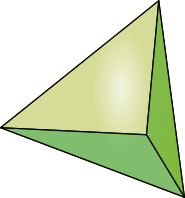

> 这一篇是解释上一篇内容的背后的数学背景, 不喜可以不看. 但是, 我要说的是, 数学很美妙, 之所以看上去很烦人, 主要是因为遇到的老师不好.

###### 最长插入法的理论基础: 凸包理论

咱们先用二维空间 - 也就是平面来举例.

最简单的凸包就是单纯形, 

- 二维空间中的单纯形就是: 三角形, 
- 三位空间的单纯形是四边形.

###### 二维空间的闵可夫斯基定理的图示

这幅图穿过顶点的线组成了一个凸包:  从平面的角度来看, 任意多的点形成的集合中总是可以挑出一些点, 他们连成线形成一个完美的凸包, 这个凸包包含点集中所有的点, 不信大家可以试试. 

这个结论扩展到多维就是: 闵可夫斯基定理

###### 闵可夫斯基定理

这个理论简单的说就是: n维空间中的一些点中总有一些点连线之后可以完美的构成凸包, 这个凸包包含这个点集中的所有的点. 这些点就分成了两部分, 顶点和内点. 这个就是闵可夫斯基定理.

有一个简单的结论: tsp的复杂度只和内点数量有关, 因为边点一定是顺序访问的.

- 最远点插入法的思路就是找到顶点, 然后确认顶点的顺序, 
- 最远点插入法的误差就在于内点插入的位置未必正确. 因为算法并未判断何时开始插入的就是内点了, 实际上算法一直当所有点都是顶点来处理的.

###### 闵可夫斯基

闵可夫斯基是一个牛人, 从闵可夫斯基定理就看出来了, 他很擅长把定理扩展到多个维度. 比如多维空间的距离定义又名: 闵可夫斯基距离:

简单的说就是n次方的和再开n次方, 不会搞公示累死我了. 下次直接手写然后拍照. 

这里我们很容易发现, 二维距离和三维距离就是我们日常使用的距离定义. 一维距离就是直角距离. 所以, 如果和小伙伴交流的时候, 你不说直角距离, 而说: '闵可夫斯基一维距离', 逼格立马上去了有没有, 而且定义非常之准确, 任谁也说不出你有什么错来.

关于闵可夫斯基还有两则八卦是大家喜闻乐见的.

1. 闵可夫斯基发明了四维空间, 嗯没错, 她是爱因斯坦的老师, 而且他叫爱因斯坦: '懒惰的狗', 爱因斯坦弄相对论的时候玩命想要摆脱老师的阴影, 但是, 最后还是认命了, 直接使用了闵可夫斯基四维空间定义. 闵可夫斯基就是这么牛.

2. 这么牛逼的人, 一定会犯傻, 就像牛顿炼金, 笛卡尔困死一样, 伟人都是逗比, 闵可夫斯基的故事是: 

   本来他是在教代数拓扑的, 但是, 他有一天进入课堂说: "四色定理之所以没有证明, 是因为只有二三流的数学家在搞, 今天咱们一起证明一下", 

   然后, 同学们就一脸懵逼的看着, 闵可夫同志很快就写满了一黑板的证明, 然后开始不停的修改…… 然后很遗憾下课时间到了. 闵可夫斯基老师决定下节课继续

   ……一个月(这个时间不见得准确, 但是考虑一流数学家的深度工作能力, 估计不会再短了)过去了, 这一天, 同学们来到课堂, 预计会看到老师继续的奋战, 这时, 天上打了一声雷, 闵可夫老师一脸诚恳的说:"上天都在批判一个骄傲自大的灵魂", 然后闵可夫老师开始继续教授代数拓扑了