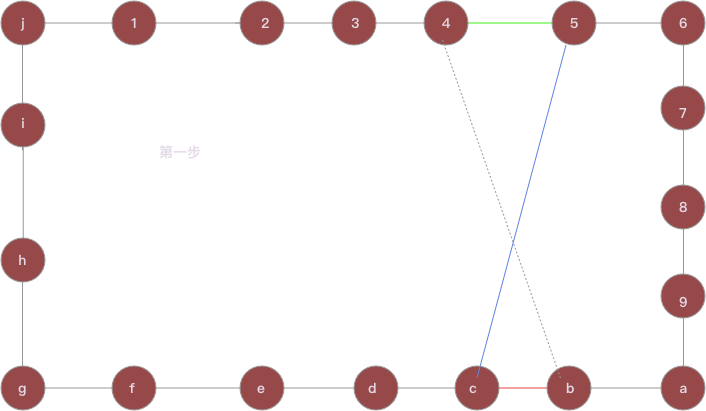
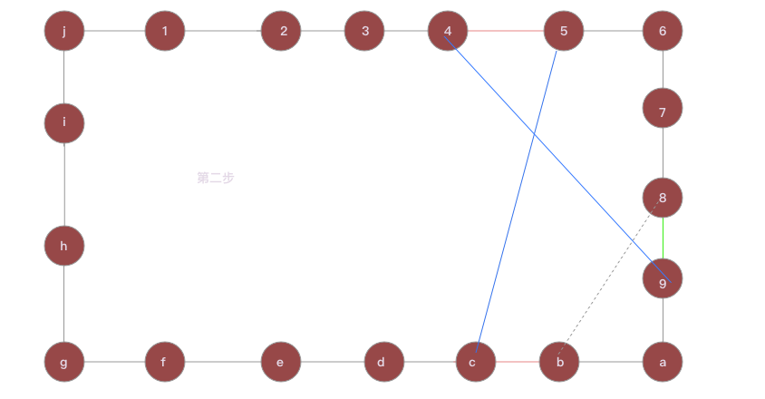

> tsp领域的问题, 并不都是tsp问题, 但是, tsp相关的算法一般都能解决, 只要你能为某一个充满个性的问题儿子找到他亲生的解决方案爸爸.

经过前面8篇的努力, 我们实际上已经解决了几乎所有的订单分配问题, 但是, 分配不等于实际路线, 如果经过计算, 我们给一个人分配了50单, 或者通过比如无人机技术, 我们可以24小时配送100单, 那么这100单怎么排布路线? 

###### 需求分析

- 给100单这个数量级的订单排布路线. 订单数量级: 100 到 1000.
- 随时会插入订单, 为了优化效率, 这个计算我们在客户端计算, 也就是在手机上计算. 
- 考虑无人机的情况, 这个计算要非常有效率, 因此, 我们用简单算法中效率最高的LK算法.

###### LK简介

- LK是一个交换的思路. 
  - 比如: 12345形成了一条路径
  - 我们发现23这一段和45这一段交换成24和35会快.
  - 最终交换出来的路线就是12435. 如图示: 

- LK是一个对初始路线不敏感的算法, 我们可以想象成爬山, 他总能爬到附近的一个高峰, 但是, 这个高峰不见得是珠穆朗玛峰. 因此, 后续有动态的LKH算法和链式LK算法
- LK本身就是链式调用的. 参见下图:

- 我们从C点出发, 目标是替换掉cb这根红线.
- 我们发现c5这根蓝线<cd. 那么就用c5这根蓝线替换掉cb这根红线.
- 此时, 还需记录一个判断就是蓝线+虚线是否小于红线+绿线. 如果小, 那么这就是一次完美的二交换, 不论是否小, 都要继续进行下去.

- 此时, 尝试用49取代45, 只要(49+5c)<(45+cb), 蓝线的总和<红线的总和.
- 如果此时(49+5c+8b)<(45+cb+89), 那么这就是一次成功的三交换.
- 同样的不论是否三交换成功, 我们都继续交换下去, 下一次考虑的是绿线89的替换蓝线.
- 如此不停的交换下去, 直到没有办法做新的交换. 那么就回退到有更多选择的步骤, 再次进行交换.
- 程序的终止为设计的次数/时间到了, 或者进行了充分的交换, 没有新的交换可以做了为止.
- LK算法其实是以2交换为基础的持续交换策略.

###### lk的扩展

- lkh将基础2交换替换为5交换. keld helsgaun实现
- 链式lk在一次lk找到解的情况下, 做一次随机4交换, 然后继续做lk.
- 动态lk, 能够根据需要做10交换等等更高的交换, Applegate和keld helsgaun分别实现

###### lk的实现

lk的实现是非常困难的. 有大量的细节, 且听下回分解.